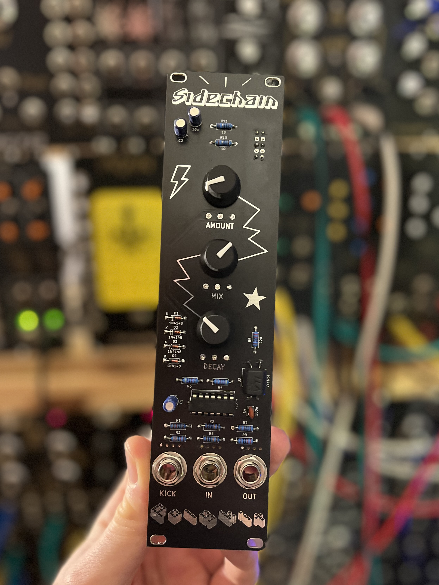

# Kosmo Sidechain (Ducking) Module

This repository contains schematics and PCB layout files of a Sidechain/Ducking module in Kosmo format originating on a design by Juanito Moore. Gerber files can be found in the [plots](plots/) directory.

## Schematics & PCB

## BOM

|Ref           |Qnty|Value     |Name               |Description                                                     |
|--------------|----|----------|-------------------|----------------------------------------------------------------|
|C1            |1   |1u        |CP-Device          |Polarized capacitor                                             |
|C2, C3        |2   |10u       |CP-Device          |Polarized capacitor                                             |
|C4            |1   |100n      |C                  |Unpolarized capacitor                                           |
|D1, D2, D3, D4|4   |1N4148    |1N4148             |100V 0.15A standard switching diode, DO-35                      |
|J1            |1   |Kick      |AudioJack2         |Audio Jack, Mono, 6,35mm                                        |
|J2            |1   |In        |AudioJack2         |Audio Jack, Mono, 6,35mm                                        |
|J3            |1   |Out       |AudioJack2         |Audio Jack, Mono, 6,35mm                                        |
|J4            |1   |POWER     |Conn_02x05_Odd_Even|10-pin IDC Connector                                            |
|R1            |1   |10k       |R                  |Resistor                                                        |
|R2, R8        |2   |100k      |R                  |Resistor                                                        |
|R3            |1   |33k       |R                  |Resistor                                                        |
|R4, R6        |2   |47k       |R                  |Resistor                                                        |
|R5, R9        |2   |220       |R                  |Resistor                                                        |
|R7            |1   |1k        |R                  |Resistor                                                        |
|R10, R11      |2   |10        |R                  |Resistor                                                        |
|RV1           |1   |Mix 10k   |R_POT-Device       |Potentiometer                                                   |
|RV2           |1   |Amount 10k|R_POT-Device       |Potentiometer                                                   |
|RV3           |1   |Decay 100k|R_POT-Device       |Potentiometer                                                   |
|U1            |1   |TL074     |TL074              |Quad Low-Noise JFET-Input Operational Amplifiers, DIP-14/SOIC-14|
|U2            |1   |Vactrol   |VTL5C              |Low Cost Axial Vactrols                                         |

## References

https://www.youtube.com/watch?v=cXaip9cjlhU

https://www.instructables.com/Freestyle-High-Fidelity-Ducking-Circuit/

https://lookmumnocomputer.discourse.group/t/side-chain-module-ducking
