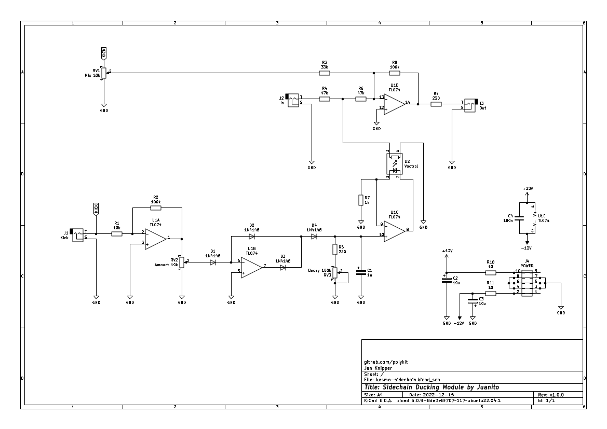

# Kosmo Sidechain (Ducking) Module

This repository contains schematics and PCB layout files of a Sidechain/Ducking module in Kosmo format originating on a design by Juanito Moore. Gerber files can be found in the [plots](plots/) directory.

## Schematics & PCB

## BOM

|Ref             |Qnty|Value     |Name               |Footprint                                                     |Description                                                                                                                                                                  |
|----------------|----|----------|-------------------|--------------------------------------------------------------|-----------------------------------------------------------------------------------------------------------------------------------------------------------------------------|
|C1,             |1   |1u        |CP-Device          |Capacitor_THT:CP_Radial_D5.0mm_P2.00mm                        |                                                                                                                                                                             |
|C2, C3,         |2   |10u       |CP-Device          |Capacitor_THT:CP_Radial_D5.0mm_P2.00mm                        |                                                                                                                                                                             |
|C4,             |1   |100n      |C                  |Capacitor_THT:C_Disc_D3.8mm_W2.6mm_P2.50mm                    |Unpolarized capacitor                                                                                                                                                        |
|D1, D2, D3, D4, |4   |1N4148    |1N4148             |Diode_THT:D_DO-35_SOD27_P7.62mm_Horizontal                    |100V 0.15A standard switching diode, DO-35                                                                                                                                   |
|J1,             |1   |Kick      |AudioJack2         |telec:Jack_Hole_Square                                        |Audio Jack, 2 Poles (Mono / TS)                                                                                                                                              |
|J2,             |1   |In        |AudioJack2         |telec:Jack_Hole_Square                                        |Audio Jack, 2 Poles (Mono / TS)                                                                                                                                              |
|J3,             |1   |Out       |AudioJack2         |telec:Jack_Hole_Square                                        |Audio Jack, 2 Poles (Mono / TS)                                                                                                                                              |
|J4,             |1   |POWER     |Conn_02x05_Odd_Even|Connector_IDC:IDC-Header_2x05_P2.54mm_Vertical                |10-pin IDC Connector                                                                                                                                                         |
|R1,             |1   |10k       |R                  |Resistor_THT:R_Axial_DIN0207_L6.3mm_D2.5mm_P10.16mm_Horizontal|Resistor                                                                                                                                                                     |
|R2, R8,         |2   |100k      |R                  |Resistor_THT:R_Axial_DIN0207_L6.3mm_D2.5mm_P10.16mm_Horizontal|Resistor                                                                                                                                                                     |
|R3,             |1   |33k       |R                  |Resistor_THT:R_Axial_DIN0207_L6.3mm_D2.5mm_P10.16mm_Horizontal|Resistor                                                                                                                                                                     |
|R4, R6,         |2   |47k       |R                  |Resistor_THT:R_Axial_DIN0207_L6.3mm_D2.5mm_P10.16mm_Horizontal|Resistor                                                                                                                                                                     |
|R5, R9,         |2   |220       |R                  |Resistor_THT:R_Axial_DIN0207_L6.3mm_D2.5mm_P10.16mm_Horizontal|Resistor                                                                                                                                                                     |
|R7,             |1   |1k        |R                  |Resistor_THT:R_Axial_DIN0207_L6.3mm_D2.5mm_P10.16mm_Horizontal|Resistor                                                                                                                                                                     |
|R10, R11,       |2   |10        |R                  |Resistor_THT:R_Axial_DIN0207_L6.3mm_D2.5mm_P10.16mm_Horizontal|Resistor                                                                                                                                                                     |
|RV1,            |1   |Mix 10k   |R_POT-Device       |telec:Potentiometer_Single_Vertical_Hole                      |                                                                                                                                                                             |
|RV2,            |1   |Amount 10k|R_POT-Device       |telec:Potentiometer_Single_Vertical_Hole                      |                                                                                                                                                                             |
|RV3,            |1   |Decay 100k|R_POT-Device       |telec:Potentiometer_Single_Vertical_Hole                      |                                                                                                                                                                             |
|U1,             |1   |TL074     |TL074              |Package_DIP:DIP-14_W7.62mm_Socket_LongPads                    |Quad Low-Noise JFET-Input Operational Amplifiers, DIP-14/SOIC-14                                                                                                             |
|U2,             |1   |Vactrol   |VTL5C              |OptoDevice:PerkinElmer_VTL5C                                  |Low Cost Axial Vactrols                                                                                                                                                      |
## References

https://www.youtube.com/watch?v=cXaip9cjlhU

https://www.instructables.com/Freestyle-High-Fidelity-Ducking-Circuit/

https://lookmumnocomputer.discourse.group/t/side-chain-module-ducking
